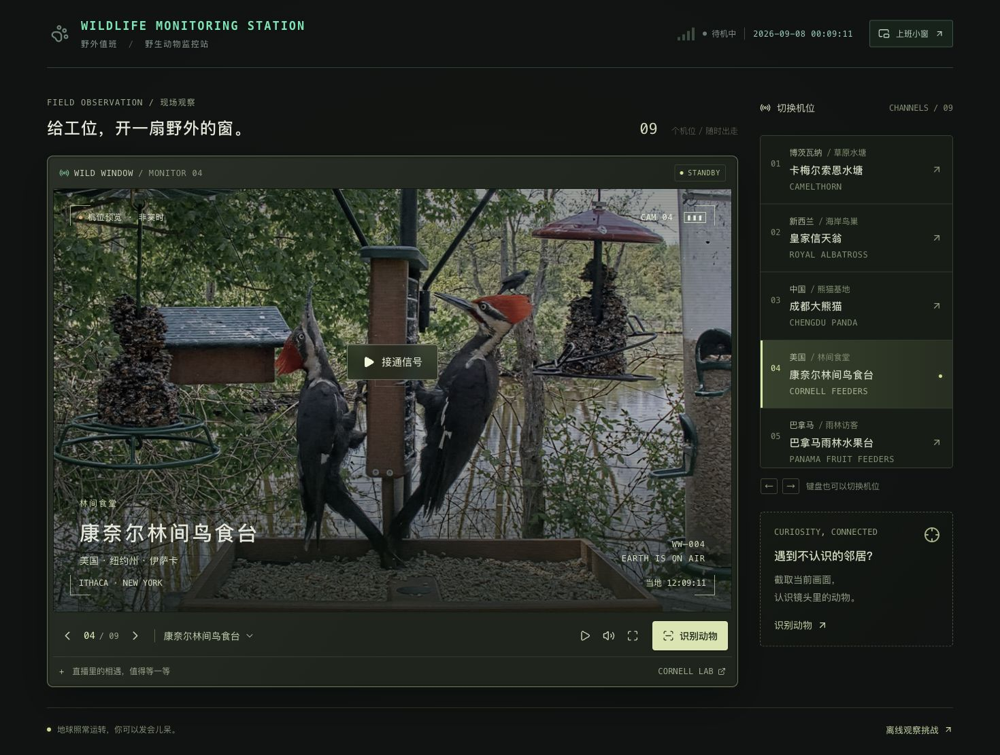
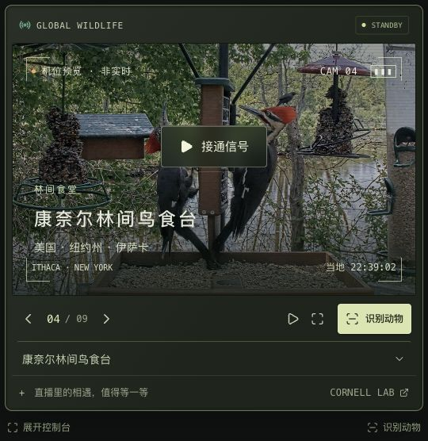

# Global Wildlife Monitor · 全球动物监控

给工位开一扇野外的窗。一个复古监控器风格的动物直播小窗口：切换机位、看远方的动物，遇到好奇的邻居就用本机 Qwen3-VL 识别。

**开源、可在自己的电脑运行，不需要 Codex 账号，不需要模型 API 密钥。**

> 这是一个由文科生和 AI 一起做出来的小项目，代码和部分文档由 AI 生成。只是想给工位开一扇看动物的窗，也希望大家用得愉快，在忙碌的日子里偶尔发会儿呆。欢迎提建议、报问题，或者一起把它变得更好。

## 界面预览

### 完整监控台



监控台实际界面：查看机位列表、切换地点，并打开动物识别入口。

### 上班小窗



点击「上班小窗」即可打开紧凑窗口，保留左右切台、机位选择和识别按钮；桌面版还支持置顶，方便边工作边看动物。

以上均为程序实际截图，显示的是 Cornell Lab 鸟食台的机位资料图，已标注「非实时」；接通信号后会切换到官方直播播放器。

## 下载使用

1. 安装 [Node.js](https://nodejs.org/) 22.13 或更新版本（推荐 24 LTS）。
2. 在 [Releases](https://github.com/Fannie0715/wild-window/releases) 下载 `wild-window-desktop.zip`，解压到自己的文件夹。
3. macOS 双击 `Start Global Wildlife Monitor.command`；Windows 双击 `Start Global Wildlife Monitor.cmd`。也可以在解压目录执行 `node scripts/launch-desktop.mjs`。
4. 首次启动会下载官方 Electron 桌面运行环境（约 125–150 MB），随后打开独立桌面窗口。关闭所有桌面窗口即可停止。

发布包已包含构建好的网页。桌面运行环境首次自动下载至 `.runtime/desktop`，以后可直接启动。桌面窗口的网页服务只监听本机 `127.0.0.1`，自动选择空闲端口。

桌面版使用 Electron，可以直接截取本窗口里的直播画面。动物直播仍需要能访问来源站的网络。保留浏览器版：执行 `node scripts/serve.mjs`，默认打开 `http://127.0.0.1:4191/`。不要直接双击 `index.html`。

## 从源码运行

```sh
git clone https://github.com/Fannie0715/wild-window.git
cd wild-window
npm ci
npm run dev
```

长期使用可以构建一次后启动：

```sh
npm run build
npm run desktop
# 浏览器版：npm start
```

## 可以做什么

- 左右按钮或键盘方向键切换机位，也可从列表选择。
- 打开独立工作小窗；桌面版的小窗会保持置顶。
- 默认静音播放，可在官方播放器内开启声音或全屏。
- 桌面版点击「识别动物」，直接截取当前播放器并交给本机 Qwen，无需屏幕共享选择器。
- 浏览器版首次允许共享当前标签页后，后续一键截图并识别。
- 也可在识别窗口直接粘贴系统截图，或选择本地图片。
- 本机 Qwen3-VL 自动识别截图，在网页显示名称、可见特征与动物介绍。
- 保留手动复制、保存图片及其他 AI 入口。

浏览器版的小窗不保证置顶；全屏、剪贴板、屏幕捕获取决于浏览器支持。截图不支持时可直接上传 JPG、PNG 或 WebP，最大 12 MB。

## 启用本地识图

使用 **Qwen3-VL 4B Instruct**，由本机 [Ollama](https://ollama.com/) 运行，无需云端 API 密钥。网页只连接本机 `127.0.0.1:11434`，不调用千问 App 或云端千问 API。

1. Apple Silicon Mac（macOS 14+）：双击「启用本地识图.command」，会下载官方 Ollama CLI（约 152 MB）和模型（约 3.3 GB）。程序和权重保存在 `.runtime/`，不提交到 GitHub，不打进发布 ZIP。
2. Windows、Intel Mac、Linux：先从 [Ollama 官方网站](https://ollama.com/download) 安装并打开 Ollama，然后双击「启用本地识图.cmd」或运行 `node scripts/setup-ai.mjs`。也可执行 `ollama pull qwen3-vl:4b-instruct`。
3. 打开 Global Wildlife Monitor，点击「识别动物」。如果网页已打开，点击「重新检测」；本地网页会按需启动已安装的 Ollama。
4. 桌面窗口默认接通直播。看到动物后，点击「识别动物」，程序截取自己的播放器区域，自动交给 Qwen3-VL，直接显示结果。点击「再看一帧」可更新截图。第一次加载模型可能较慢。

后续启动网页会自动连接或启动本地模型。脚本不会自动下载模型，首次下载由「启用本地识图」明确触发。安装过的官方 Ollama 使用原有模型目录；项目附带的 CLI 使用 `.runtime/models`。需要足够的磁盘与运行内存，模型下载大小不等于内存占用；16 GB Apple Silicon Mac 为当前验证环境。尚未实测 Windows、Intel Mac 和 Linux 的推理速度。

**桌面版**使用 Electron 的窗口截图接口，仅截取本程序的直播区域，包括其中的跨域播放器；不截取桌面或其他程序，无需屏幕录制授权或 Codex 工具。窗口缩放、切台或截图取消时会丢弃过期画面。请保持直播窗口可见。

**浏览器版**使用桌面 Chromium 的 Region Capture（推荐桌面 Chrome / Edge）。浏览器首次共享授权无法省略；误选其他标签页、窗口或屏幕会停止截取，不会自动发送整屏。当前浏览器不支持时，可以复制地址到桌面 Chrome，或在识别窗口用 ⌘V / Ctrl+V 粘贴系统截图。

浏览器版共享经授权后会持续，方便重复取帧；可随时在页面或浏览器点击「停止共享」。每次仅处理用户点击时的一帧，不采集音频。截图前会隐藏识别弹窗并等待新画面；请保持网页和播放器可见。粘贴或上传图片也会自动识别；最长边缩小到 1280px。截图只在网页及本机推理服务内存中处理，不写入磁盘（除非点击保存），也不上传云端。没有账号系统、遥测或云端图片存储。

AI 会误认物种，尤其是远景、夜视、幼体或遮挡画面。结果中的「特征较清楚／可能是／暂无法确定」是模型的定性判断，不是校准的置信度。图像中的机位标题与地点不会作为物种判断依据。

**本地识图需要本地安装版。** 静态部署网址可以看直播、上传/保存图片和打开其他 AI，但不会从远程页面自动访问你电脑的 Ollama。小红书离线小游戏不包含模型，玩法保持离线观察挑战。

## 当前机位

| 机位 | 地点 | 来源 |
| --- | --- | --- |
| 卡梅尔索恩水塘 | 博茨瓦纳 · 博泰蒂河 | [Africam 官方机位](https://africam.com/lodge/camelthorn/) |
| 皇家信天翁 | 新西兰 · 泰瓦罗瓦角 | [Cornell Lab](https://www.allaboutbirds.org/cams/royal-albatross/) |
| 成都大熊猫 | 中国 · 成都大熊猫繁育研究基地 | [iPanda 官方 YouTube 直播](https://www.youtube.com/watch?v=SUXPnIEpbn4) |
| 康奈尔林间鸟食台 | 美国 · 纽约州伊萨卡 | [Cornell Lab](https://www.allaboutbirds.org/cams/cornell-lab-feederwatch/) |
| 巴拿马雨林水果台 | 巴拿马 · 安东谷 | [Cornell Lab / Canopy Lodge](https://www.allaboutbirds.org/cams/panama-fruit-feeders/) |
| 巴拿马蜂鸟驿站 | 巴拿马 · 索韦拉尼亚国家公园 | [Cornell Lab / Canopy Tower](https://www.allaboutbirds.org/cams/panama-hummingbird-feeders/) |
| 赫尔盖特鱼鹰巢 | 美国 · 蒙大拿州米苏拉 | [Cornell Lab](https://www.allaboutbirds.org/cams/hellgate-ospreys/) |
| 坦贝大象水塘 | 南非 · 马普托兰 | [Africam](https://africam.com/lodge/tembe-elephant-park/) |
| 斯托尼角企鹅海岸 | 南非 · 贝蒂湾 | [Africam](https://africam.com/lodge/penguins/) |

采用官方公开的 YouTube 嵌入播放器，保留原站入口。2026-09-07 核验当前播放器，新增的成都熊猫、四路 Cornell 鸟类机位、坦贝水塘和企鹅海岸均已在官方页面实际播放。熊猫改用 iPanda 官方 YouTube 线路，和原先受限的 CCTV 网页播放器不同。

接通信号后，左右切台会直接加载下一个播放器；也可以断开回到预览。加载异常可点「重连」，或在新标签页打开原站。预览图片不是实时画面；鸟巢可能空巢，部分机位夜间较暗。直播可能更换 ID、临时中断或受到地区限制；**可嵌入不等于任何网络都能播放**。

原麋鹿、白马雪山线路尚未找到可正常播放的官方替代入口。Skyline 东察沃的官方说明只允许摄像头所有者嵌入直播，其他网站仅可嵌入每 5 分钟更新的照片，暂不混入直播列表。参见 [Skyline 官方嵌入说明](https://www.skylinewebcams.com/zh/support/faq.html)。

修改机位：编辑 `lib/cameras.ts`，保留官方来源和可公开嵌入的播放器地址。不要加入需要绕过签名、防盗链或地区限制的流地址。机位数和切换逻辑会自动随列表更新。

## 开发与分发

使用 React、TypeScript、Vite、Tailwind CSS、Base UI、Lucide 和 Electron。桌面主进程和预加载代码位于 `desktop/`；跨域页面没有 Node.js 权限，截图接口仅向本程序主页面开放。

```sh
npm test                 # 桌面截图边界、本地服务、识图接口与小游戏测试
npm run desktop          # 独立桌面窗口，一键截图识别
npm run setup:ai         # 首次启用本地 Qwen3-VL（约 3.3GB）
npm run build            # 类型检查 + 静态网页构建
npm run pack:desktop     # release/wild-window/ 本地分发目录
npm run pack:game        # release/xiaohongshu-game/ 小红书包内容
```

macOS 首次启动会为仅含链接器签名的 Electron 运行包补做本地开发签名；不会覆盖 Developer ID 签名，也不会更改系统安全设置。这是从源码/启动包运行的版本，尚未提供经过 Apple 公证的独立安装器。

桌面截图已在 Apple Silicon Mac 验证；Windows、Intel Mac 与 Linux 代码路径尚未实机验证。

CI 会构建并测试。推送 `v*` 标签会打包一个包含已构建网页的桌面下载 ZIP。项目可以放在任何静态网站服务上，构建结果位于 `dist/`。

支持浏览器可选 WebMCP 工具：读取机位、切换机位、打开动物观察员。工具不会自动截图、上传图片或发送第三方消息；普通浏览器不受影响。

## 许可

项目原创代码采用 [MIT License](LICENSE)。第三方依赖、直播、照片与商标保留各自权利，直播与预览照片不在 MIT 授权范围内。详见 [第三方内容说明](THIRD_PARTY_NOTICES.md)。
